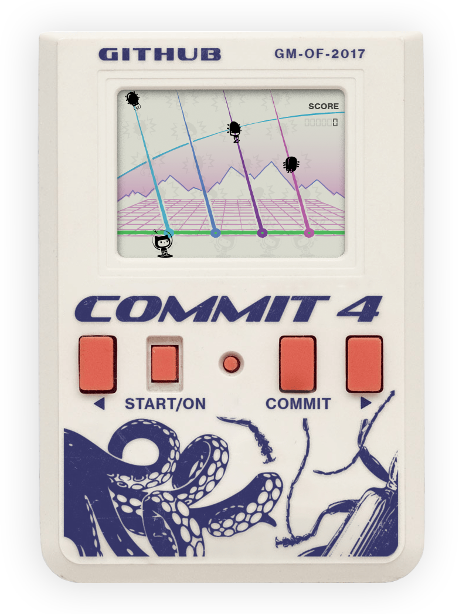

# COMMIT4

A retro LCD game by [Balaj Marius](https://balajmarius.com/). Control the Octocat and shoot incoming bugs before they reach your branch.

Winner of **Best Theme Interpretation** at [GitHub Game Off 2017](https://github.blog/open-source/gaming/game-off-2017-winners/).

[Play COMMIT4](https://commit4.balajmarius.com/)



## Controls

| Key                | Action                           |
| ------------------ | -------------------------------- |
| Any key            | Start or restart after game over |
| Left / Right arrow | Move between lanes               |
| Space              | Fire on the current lane         |

Each hit adds one point. The game ends when a bug passes the last cell on any lane.

## Development

Use Node.js **20.19+ within Node 20**, or **22.12+**, as specified in `package.json`.

```bash
npm install
npm run dev
```

Open the URL printed by Vite, normally [localhost:5173](http://localhost:5173). `npm start` runs the same development server.

The current implementation uses React, TypeScript, PixiJS, Tailwind CSS, and Howler, with Vite for development and builds.

## Commands

| Command                | Purpose                                          |
| ---------------------- | ------------------------------------------------ |
| `npm run dev`          | Start the development server                     |
| `npm run build`        | Typecheck and build into `dist/`                 |
| `npm run preview`      | Serve the production build locally               |
| `npm run typecheck`    | Check TypeScript types                           |
| `npm run lint`         | Run Oxlint                                       |
| `npm run lint:fix`     | Apply available lint fixes                       |
| `npm run format`       | Format files with Oxfmt                          |
| `npm run format:check` | Check formatting without changing files          |
| `npm run check`        | Run typechecking, linting, and formatting checks |

Formatting uses double quotes, semicolons, two-space indentation, and a print width of 110.

GitHub Actions runs `npm run lint` and `npm run format:check` independently on every push. Both checks report failures without modifying files. The workflow is defined in [`.github/workflows/checks.yml`](.github/workflows/checks.yml).

## Project structure

| Path                    | Responsibility                                                  |
| ----------------------- | --------------------------------------------------------------- |
| `src/core/commit4.tsx`  | Case layout and screen overlay                                  |
| `src/core/scene.tsx`    | Pixi application and game components                            |
| `src/context/game.tsx`  | Lane state, keyboard controls, score, collisions, and game loop |
| `src/components/`       | Bugs, bullets, Octocat, and score rendering                     |
| `src/hooks/useAtlas.ts` | Load and parse the sprite atlas                                 |
| `src/hooks/useSfx.ts`   | Load and play sound effects                                     |
| `src/utils/const.ts`    | Shared cell and sprite constants                                |
| `src/static/`           | Images, sprite atlas, sounds, and CSS                           |
| `index.html`            | Page metadata, social tags, and game structured data            |

## Game loop

The game stores four lanes, each with a bug position, bullet position, and optional collision. A position of `-1` means the cell is idle. Game state is `off`, `on`, or `dead`.

One `requestAnimationFrame` loop coordinates movement:

- Every 500 ms, a randomly selected lane spawns or advances a bug, unless an impact is holding it in place.
- Every 200 ms, bullets advance and register hits at their current or next cell.
- A hit keeps the bullet visible until the next bullet tick. The bug and explosion clear after 500 ms.
- Moving a bug past the last cell stops the loop and plays the death sound.

Timing for movement lives in `src/context/game.tsx`; explosion duration and cell limits live in `src/utils/const.ts`.

## Production

```bash
npm run build
npm run preview
```

Deploy the contents of `dist/` to a static host. The live game is hosted on Cloudflare Pages under the `commit4` project.

## License

[MIT](LICENSE).
