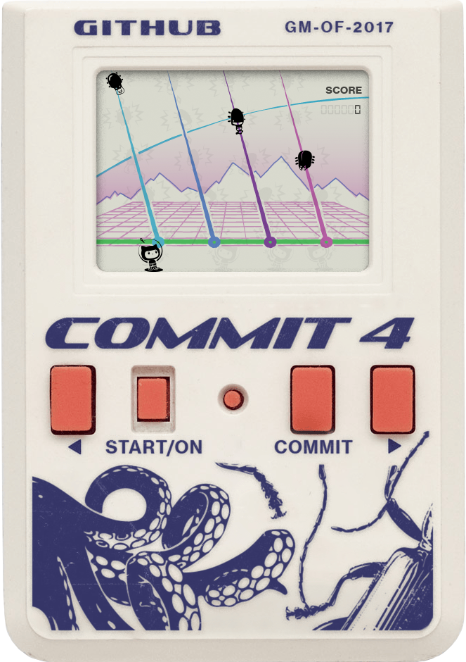

# COMMIT4

A retro LCD game. Control the Octocat and shoot incoming bugs before they reach your branch.

Winner of **Best Theme Interpretation** at [GitHub Game Off 2017](https://github.blog/open-source/gaming/game-off-2017-winners/).

[Play COMMIT4](https://commit4.balajmarius.com/)



## Controls

Press **Enter** or click **Start/On** to start or restart. Use **← / →** to move and **Space** to shoot.

## Development

Requires Node.js 22.12+.

```bash
npm install
npm run dev
```

- `npm run build` — build into `dist/`.
- `npm run preview` — preview the production build.
- `npm run check` — check types, lint, and formatting.
- `npm run format` — format the code.

`npm install` enables Git hooks: staged files are formatted and linted before commit, and messages must follow Conventional Commits, for example `fix: keep octocat visible after game over`.

GitHub Actions checks lint and formatting on every push. Pushes to `master` also deploy to Cloudflare Pages after checks and the build pass.

## License

[MIT](LICENSE).
